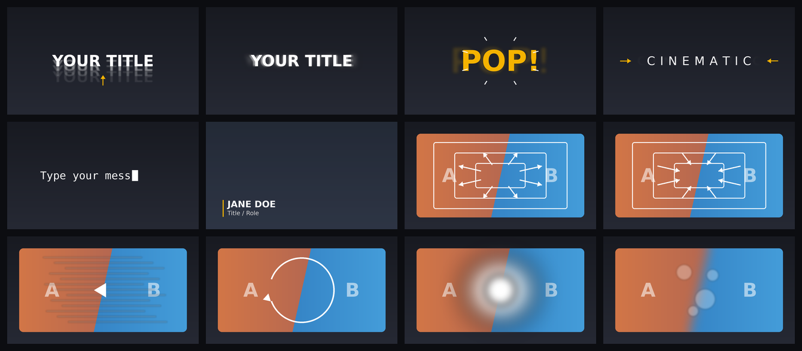

# Loom Letter

Premiere Composer-style **text presets and transitions for DaVinci Resolve Studio**:
pick a look in a panel, click once, and it lands on your timeline.



- **Loom Letter panel** (Workspace > Scripts > Loom Letter) with a searchable list of presets,
  previews, and one-click apply.
- **6 animated titles**: Slide Up, Blur In, Pop, Tracking, Typewriter, Lower Third. They are
  real Fusion Titles, so every look stays editable in the Inspector, and the in/out animation
  follows the clip when you trim it.
- **6 cut transitions**: Zoom In, Zoom Out, Whip Pan, Spin, Flash, Blur. Apply one to the cut
  under the playhead or to every cut in a selection. No handles needed.

> **Status: v0.1.0, first build.** It was written against the Resolve 21 scripting reference
> and tested headlessly (template validator + mocked Resolve), but it hasn't been run inside
> Resolve yet. Click **Diagnostics** in the panel first; it checks the parts that can only be
> checked in the real app (see [First run](#first-run-diagnostics)).

## Requirements

- **DaVinci Resolve Studio 19.1 or newer** for the panel. Blackmagic made the scripting UI
  (UIManager) Studio-only in 19.1.
- The title templates also work in the **free** version: drag them from
  Effects Library > Titles > Fusion Titles.

## Install

Close DaVinci Resolve, then from this folder:

| System | Command |
| --- | --- |
| macOS / Linux | `./install.sh` |
| Windows | `powershell -ExecutionPolicy Bypass -File install.ps1` |

Start Resolve again. The installer copies three things into your user Fusion folder:

| What | Where (inside the Fusion folder) |
| --- | --- |
| Panel script | `Scripts/Utility/Loom Letter.lua` |
| Title templates | `Templates/Edit/Titles/Loom Letter/*.setting` |
| Preview images | `LoomLetter/previews/*.png` |

The Fusion folder is `~/Library/Application Support/Blackmagic Design/DaVinci Resolve/Fusion`
on macOS, `%APPDATA%\Blackmagic Design\DaVinci Resolve\Support\Fusion` on Windows, and
`~/.local/share/DaVinciResolve/Fusion` on Linux. Set `LOOMLETTER_FUSION_DIR` to install
somewhere else.

Uninstall with `./install.sh --uninstall` or `install.ps1 -Uninstall`.

## First run: Diagnostics

Open a project and a timeline, then open **Workspace > Scripts > Loom Letter** and click
**Diagnostics**. It checks each Resolve behavior Loom Letter depends on, all on a scratch
timeline, and shows a report:

- Titles can be found and inserted by name.
- A title's animation evaluates correctly (hidden → visible → hidden).
- Titles can be placed on a chosen track and frame.
- A transition's nodes animate on the right frames of a clip.
- Transitions can be removed cleanly.

Diagnostics creates a **Loom Letter** bin holding a **Loom Letter Scratch** timeline. Your
own timeline isn't touched. (For the clip test, have at least one video clip in the Media
Pool.) If a line says `FAIL`, copy the report. The same text is also in
`<Fusion folder>/LoomLetter/logs/loomletter.log`.

## Using the panel

The panel is a floating window that stays on top of Resolve. Switch between **Titles** and
**Transitions** at the top left, and use the search box to filter presets. Double-clicking a
preset applies it.

### Titles

1. Park the playhead where the title should start.
2. Pick a preset. Optionally fill in **Text**, **Line 2** (lower third role), **Font**,
   **Style**, **Color**, and **Accent**. Empty fields keep the preset's defaults.
3. Set the length in **Seconds**, plus the **In** and **Out** animation lengths in frames.
4. Click **Add Title at Playhead**.

The title goes on the first free video track above whatever sits under the playhead. If no
track is free, Loom Letter adds one. Nothing on your timeline is rippled or overwritten.

Once it's placed, select the title and open the Inspector to change the text, font, color,
position, and intro/outro frames. Trim the clip and the outro moves with it.

### Transitions

- **Apply to Cut at Playhead** finds the edit closest to the playhead, within 2 seconds.
  **Track** is set to **Auto** by default; pick a track to limit the search.
- **Apply to Every Cut in Selection**: select a run of clips on the timeline, then click. Every
  place two selected clips touch gets the transition.
- **Frames / side** sets how long the effect ramps on each side of the cut. **Intensity**
  scales it. **Direction** applies to Whip Pan and Spin (for Spin, Left/Up means
  counter-clockwise). **Motion blur** looks better but renders slower.
- Applying again replaces the transition that's there. **Remove from Selected Clips** takes
  Loom Letter's transitions off.

Transitions live inside each clip's Fusion composition. They show up on the Fusion page as
nodes named `LL_Out_…` (end of the outgoing clip) and `LL_In_…` (start of the incoming clip),
placed just before `MediaOut1`. Any Fusion work already on the clip is kept. Because clips
become Fusion clips, turn on **Playback > Render Cache > Smart** if playback stutters.

## Why aren't these "real" Resolve transitions?

Resolve's scripting API has no way to add a transition to an edit point. Premiere Composer
gets around the same problem in Premiere by placing adjustment layers over the cut. The
closest thing a Resolve script can do is animate the frames on either side of the cut inside
each clip's Fusion comp. That has upsides: there's no need for handles (extra media), and the
effect stays attached to the cut when you trim either clip.

Details are in [docs/HOW-IT-WORKS.md](docs/HOW-IT-WORKS.md).

## Adding presets

- **Titles**: add a builder function to `tools/build_templates.py` and run
  `python3 tools/build_templates.py`. Check the result with the validator (see below), then
  add an entry to `LL.TITLES` in `Fusion/Scripts/Utility/Loom Letter.lua`.
- **Transitions**: add an entry to `LL.CUTS` in the same script. Its `build` function returns
  the nodes for one side of the cut.
- **Previews**: `python3 tools/make_previews.py` redraws the cards. To use a real frame
  instead, save a 640×360 PNG over the matching file in `Fusion/LoomLetter/previews`.

## Development

```
Fusion/                      mirrors Resolve's Fusion folder (the installer copies this)
  Scripts/Utility/Loom Letter.lua              the panel (one self-contained Lua file)
  Templates/Edit/Titles/Loom Letter/*.setting  generated title templates
  LoomLetter/previews/*.png                    preview cards
tools/build_templates.py     generates the .setting files
tools/validate_settings.lua  checks templates and simulates their animation
tools/make_previews.py       draws the preview cards
tests/run_tests.lua          unit + integration tests (mock Resolve/Fusion/UIManager)
```

Run the checks with LuaJIT (`brew install luajit` / `apt install luajit`):

```sh
luajit tools/validate_settings.lua "Fusion/Templates/Edit/Titles/Loom Letter/"*.setting
luajit tests/run_tests.lua
```

To use the interpreter that ships with Resolve, run `fuscript -l lua tests/run_tests.lua`.
On macOS, `fuscript` is in `/Applications/DaVinci Resolve/DaVinci Resolve.app/Contents/Libraries/Fusion/`.
CI runs both checks, confirms the generated templates are up to date, and runs both
installers.

## Troubleshooting

- **No "Loom Letter" in Workspace > Scripts**: restart Resolve after installing, and check that
  `Scripts/Utility/Loom Letter.lua` is in the Fusion folder listed above. The window needs
  Resolve Studio.
- **"Resolve could not find the Fusion title …"**: the templates aren't installed, or Resolve
  hasn't been restarted since they were. They should also appear under Effects Library > Titles.
- **Titles are added as compound clips**: this Resolve build didn't provide a media pool item
  for titles, so Loom Letter wrapped the title in a compound clip to place it without
  rippling. Right-click it and choose **Decompose in Place** to get the editable title back.
- Anything else: check `<Fusion folder>/LoomLetter/logs/loomletter.log`.
